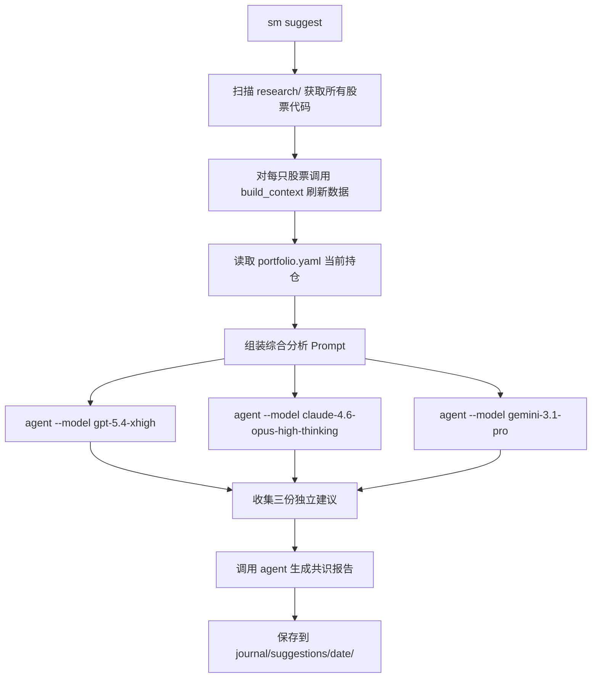

# sm suggest 多模型投资建议命令

## 现状分析

- 项目已有 `agent` CLI 调用先例：`[cli.py](src/stock_master/cli.py)` 的 `snapshot` 命令通过 `subprocess.run(["agent", "-p", "--force", prompt])` 调用 Cursor Agent
- `[pipeline/providers.py](src/stock_master/pipeline/providers.py)` 已预留 `CursorCliProvider` 占位
- 研究数据按 `research/{code}/{date}/context.md` 组织，`[build_context()](src/stock_master/pipeline/context_builder.py)` 可自动刷新
- 当前持仓在 `[journal/portfolio.yaml](journal/portfolio.yaml)`

## 三个目标模型 (agent --model)


| 用户描述               | agent model ID                  | 显示名                |
| ------------------ | ------------------------------- | ------------------ |
| gpt-5.4 extra high | `gpt-5.4-xhigh`                 | GPT-5.4 Extra High |
| opus 4.6           | `claude-4.6-opus-high-thinking` | Opus 4.6 Thinking  |
| gemini 3.1 pro     | `gemini-3.1-pro`                | Gemini 3.1 Pro     |


## 执行流程




## 新增文件

### `src/stock_master/pipeline/suggest.py` — 核心逻辑模块

```python
MODELS = [
    ("gpt-5.4-xhigh", "GPT-5.4 Extra High"),
    ("claude-4.6-opus-high-thinking", "Opus 4.6 Thinking"),
    ("gemini-3.1-pro", "Gemini 3.1 Pro"),
]
```

关键函数：

- `scan_researched_codes()` — 扫描 `research/` 目录下所有子目录名作为股票代码
- `refresh_all_contexts(codes)` — 对每个 code 调用 `build_context()`，返回 `{code: context_text}` 映射
- `build_suggestion_prompt(contexts, portfolio)` — 组装完整的分析提示词，包含：所有股票最新上下文、当前持仓快照、要求输出结构化的买入/卖出/持有/加仓/减仓建议
- `call_agent_model(model_id, prompt) -> str` — 调用 `subprocess.run(["agent", "-p", "--model", model_id, "--mode", "plan", "--trust", prompt], capture_output=True, text=True)`，返回 stdout
- `build_consensus_prompt(model_outputs) -> str` — 将 3 份独立分析结果组装为共识提示词
- `run_suggest(no_refresh, codes_filter) -> Path` — 主编排函数

并行策略：使用 `concurrent.futures.ThreadPoolExecutor(max_workers=3)` 同时调用 3 个模型，大幅缩短等待时间。

### Prompt 设计要点

分析提示词核心结构：

```
你是一位资深投资顾问。基于以下研究数据和持仓状况，给出具体的投资操作建议。

## 当前持仓
{portfolio_yaml 内容}

## 研究标的上下文
### {股票名} ({代码})
{context.md 内容}
...

## 要求
1. 对每只研究标的给出明确建议：强买入/买入/持有/减持/卖出/回避
2. 建议仓位比例（占总资金百分比）
3. 入场/出场价位建议
4. 风险提示与止损位
5. 综合考虑持仓集中度和风险敞口
```

共识提示词：将 3 份模型输出作为输入，要求提取共识点、分歧点，输出最终综合建议。

## 修改文件

### `[src/stock_master/cli.py](src/stock_master/cli.py)` — 新增 suggest 命令

在现有命令之后添加：

```python
@app.command()
def suggest(
    no_refresh: bool = typer.Option(False, "--no-refresh", help="跳过数据刷新，使用现有上下文"),
    codes: Optional[list[str]] = typer.Option(None, "--code", "-c", help="仅分析指定股票（可多次使用）"),
) -> None:
    """多模型智能投资建议 — 调用 GPT/Claude/Gemini 生成综合决策."""
```

命令行为：

1. 检查 `agent` CLI 是否可用（复用 `shutil.which("agent")` 模式）
2. 调用 `run_suggest()` 执行完整流程
3. 用 Rich 展示进度（每个模型完成时打印状态）
4. 最终打印结果目录路径和关键建议摘要

## 输出目录结构

```
journal/suggestions/
└── 2026-03-30/
    ├── _prompt.md                          # 发送给模型的完整提示词（存档可追溯）
    ├── gpt-5.4-xhigh.md                   # GPT-5.4 的独立建议
    ├── claude-4.6-opus-high-thinking.md    # Opus 4.6 的独立建议
    ├── gemini-3.1-pro.md                   # Gemini 3.1 Pro 的独立建议
    └── consensus.md                        # 三模型共识报告
```

每份模型输出文件头部带标准 frontmatter：

```markdown
# 投资建议：{model_name}
> 生成时间：{timestamp}
> 模型：{model_id}
> 分析标的：{codes}
> 持仓状态：{position_summary}
```

## 注意事项

- Agent CLI 调用使用 `--mode plan`（只读模式），避免模型误修改工作区文件
- 使用 `--trust` 跳过交互式信任确认（headless 模式必需）
- 使用 `capture_output=True` 捕获 stdout 作为建议文本
- 如果某个模型调用失败（超时/错误），记录错误但继续处理其他模型
- 同一天多次运行时，覆盖同日期目录下的文件（幂等）

