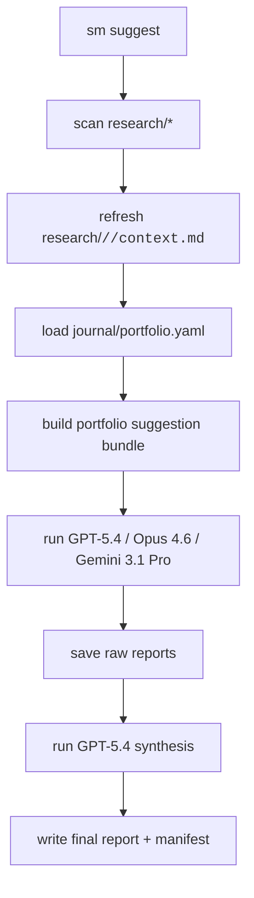

# `sm suggest` 实现计划

## 目标

- 在现有 Typer CLI 上新增 `sm suggest`，默认扫描 `research/` 下已研究过的股票代码。
- 对每只股票复用现有数据管线刷新 `research/<code>/<today>/context.md`，再结合 `journal/portfolio.yaml` 的当前持仓生成一轮组合级建议。
- 通过 Cursor CLI 的 `ask` 模式调用 3 个模型分别出建议，并把 3 份原始建议与 1 份 GPT-5.4 汇总结果全部落盘，供你最终人工判断。
- 保持现有仓库的“事实 / 判断 / 行动”分层，不覆盖已有的 `decision.md`、`journal/` 或交易记录。

## 现有可复用基础

- [src/stock_master/cli.py](src/stock_master/cli.py)：当前 `sm` 命令入口，所有子命令都通过同一个 `@app.command()` 注册，`suggest` 适合并列接入。
- [src/stock_master/pipeline/context_builder.py](src/stock_master/pipeline/context_builder.py)：`build_context()` 已经会写入 `research/<code>/<today>/context.md`。
- [src/stock_master/pipeline/orchestrator.py](src/stock_master/pipeline/orchestrator.py)：`prepare_research_dir()` 已能保证当天研究目录、`decision.md`、`synthesis.md` 存在。
- [src/stock_master/portfolio/trade_log.py](src/stock_master/portfolio/trade_log.py)：`load_portfolio()` 已能读取 `journal/portfolio.yaml`。
- [prompts/README.md](prompts/README.md)：仓库已经接受「提示词文件 + 本地产物」的工作流，适合补充自动化 `suggest` 模板。

## 推荐架构

## 文件方案

- 修改 [src/stock_master/cli.py](src/stock_master/cli.py)
  - 新增 `suggest` 命令。
  - 继续沿用现有懒加载风格，只把 CLI 参数解析、Rich 输出、异常退出放在入口层。
- 新建 [src/stock_master/pipeline/suggest.py](src/stock_master/pipeline/suggest.py)
  - 负责扫描研究股票、刷新上下文、读取持仓、组装 prompt 输入、调用模型 runner、保存产物。
  - 这里应成为该功能的单一编排入口，避免把流程逻辑塞进 `cli.py`。
- 新建 [src/stock_master/pipeline/cursor_agent.py](src/stock_master/pipeline/cursor_agent.py)
  - 统一封装 `agent --mode ask --model <id> -p ...` 的子进程调用。
  - 负责模型可用性探测、stderr/stdout 收敛、超时与退出码处理。
  - 负责“显示名 vs 实际 CLI model id”的映射，尤其处理你要求的 `gpt-5.4 extra high` 命名差异；如果本机 CLI 不支持对应 id，就显式失败而不是静默降级。
- 新建 [prompts/suggest/model-decision.md](prompts/suggest/model-decision.md)
  - 单模型建议模板，要求输出统一 Markdown 结构，例如：结论、持仓动作、候选优先级、触发条件、失效条件、风险提示。
- 新建 [prompts/suggest/final-synthesis.md](prompts/suggest/final-synthesis.md)
  - GPT-5.4 汇总模板，输入 3 份模型原始建议与组合上下文，输出最终候选决策。
- 更新 [prompts/README.md](prompts/README.md) 与 [README.md](README.md)
  - 文档化 `sm suggest` 的输入来源、输出目录、模型约束、人工确认边界。
- 新建测试文件 [tests/test_suggest.py](tests/test_suggest.py) 与 [tests/test_cursor_agent.py](tests/test_cursor_agent.py)
  - 如果仓库尚未配置测试入口，再补充 [pyproject.toml](pyproject.toml) 的最小测试依赖/配置。

## 结果落盘设计

- 每只股票的最新数据上下文仍然落在 `research/<code>/<today>/context.md`，保证单股研究链不断裂。
- 新的组合级建议会话落在 `research/_suggest/<today>/`，避免把多股票建议混入单股目录，也不污染未来对 `research/*` 的股票代码扫描。
- 建议产物结构：
  - `research/_suggest/<today>/manifest.yaml`
  - `research/_suggest/<today>/inputs.md` 或 `universe.md`
  - `research/_suggest/<today>/gpt-5.4.md`
  - `research/_suggest/<today>/opus-4.6.md`
  - `research/_suggest/<today>/gemini-3.1-pro.md`
  - `research/_suggest/<today>/final-gpt-5.4.md`
- `manifest.yaml` 记录：本次纳入的股票列表、对应 `research/<code>/<today>` 引用、持仓快照路径、模型显示名、解析后的 CLI model id、每次调用的状态/耗时/输出路径。
- 第一版不自动改写任何 `decision.md`。`sm suggest` 产出的是“候选决策

