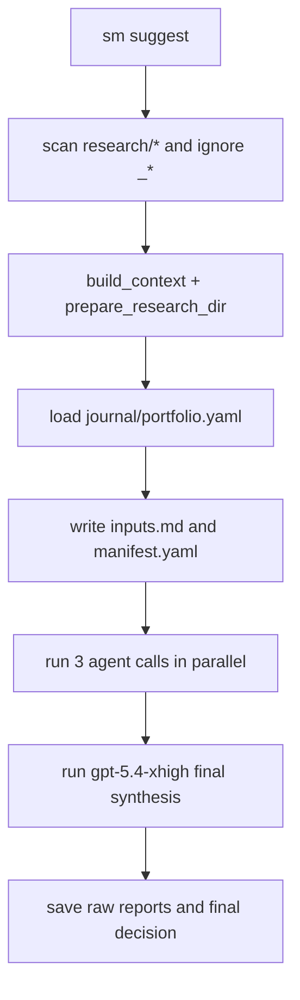

# `sm suggest` 最终实现方案

**目标**

在现有 `sm` CLI 上新增 `sm suggest`：默认扫描 `research/` 下已经研究过的股票代码，先刷新每只股票当天的 `context.md`，再结合 `journal/portfolio.yaml` 的当前持仓，通过现有 `agent` CLI 并行调用 3 个模型：`gpt-5.4-xhigh`、`claude-4.6-opus-high-thinking`、`gemini-3.1-pro`，最后再由 `gpt-5.4-xhigh` 汇总三份独立建议，输出一份组合级最终建议。

**最终定案**

- CLI 入口：沿用仓库现有的 `agent` 包装，而不是另起 `cursor` 命令体系；这样可直接复用 [src/stock_master/cli.py](src/stock_master/cli.py) 里 `snapshot` 的外部命令调用模式。
- 输出目录：按你的选择，组合级结果落在 [research/_suggest/](research/_suggest/)；但扫描研究股票时必须显式忽略以下划线开头的目录，避免把 `_suggest` 当成股票代码。
- 模型调用模式：统一使用 `agent --print --mode ask --trust --model <id>`，保持只读问答模式，避免命令在工作区做额外修改。
- 决策边界：`sm suggest` 只生成“候选决策”与可追溯产物，不自动改写任一单股 [decision.md](research/002273/2026-03-30/decision.md) 或真实交易记录，继续遵守 [README.md](README.md) 中“事实 / 判断 / 行动分层、人工最终裁决”的仓库哲学。

## 架构收敛

## 复用现有能力

- [src/stock_master/pipeline/context_builder.py](src/stock_master/pipeline/context_builder.py)：直接复用 `build_context()`，继续把单股最新上下文写到 `research/<code>/<today>/context.md`。
- [src/stock_master/pipeline/orchestrator.py](src/stock_master/pipeline/orchestrator.py)：在刷新上下文后补调用 `prepare_research_dir()`，确保当天单股目录下 `agents/`、`synthesis.md`、`decision.md` 都齐全，和现有 `sm research` 工作流保持一致。
- [src/stock_master/portfolio/trade_log.py](src/stock_master/portfolio/trade_log.py)：复用 `load_portfolio()` 读取当前组合快照，而不是在 `suggest` 里重复实现 YAML 读取。
- [src/stock_master/cli.py](src/stock_master/cli.py)：参考 `snapshot` 里现有 `subprocess.run(["agent", ...])` 模式，但把真正的模型调用细节抽到新模块，避免继续膨胀 CLI 文件。

## 文件方案

### 修改 [src/stock_master/cli.py](src/stock_master/cli.py)

新增顶层子命令 `suggest`，保持和现有 `data`、`research`、`snapshot` 一样的扁平注册方式。CLI 层只做参数解析、Rich 输出和异常退出。

建议 v1 参数保持最小集：

- `--no-refresh`：跳过 `build_context()`，直接读取已有最新 `context.md`
- `--code/-c`：可多次传入，只分析指定股票；不传则扫描全部已研究股票

### 新建 [src/stock_master/pipeline/cursor_agent.py](src/stock_master/pipeline/cursor_agent.py)

这是三份草案里最值得保留的抽象层，优于直接把 `subprocess.run()` 塞进 `cli.py`，也比现在就把整套逻辑塞进 [src/stock_master/pipeline/providers.py](src/stock_master/pipeline/providers.py) 更贴合当前仓库成熟度。

职责：

- 维护显示名与 CLI model id 的映射：
  - `GPT-5.4 Extra High` -> `gpt-5.4-xhigh`
  - `Opus 4.6 Thinking` -> `claude-4.6-opus-high-thinking`
  - `Gemini 3.1 Pro` -> `gemini-3.1-pro`
- 在运行前检查 `agent` 是否存在
- 统一执行 `agent --print --mode ask --trust --output-format text --model <id> <prompt>`
- 统一处理超时、返回码、stdout/stderr、耗时统计
- 返回结构化结果，供上层决定写入 `.md` 还是 `.error.md`

**不建议**本次直接把它并入 `providers.py`：当前那个文件仍是 Phase 4 占位接口；`sm suggest` 先做一个稳定的本地 runner，更符合仓库现状。

### 新建 [src/stock_master/pipeline/suggest.py](src/stock_master/pipeline/suggest.py)

作为组合级功能的单一编排入口，建议包含这些函数：

- `scan_researched_codes() -> list[str]`
  - 扫描 `research/` 顶层目录
  - 只接受匹配 `^\d{5,6}$` 的目录名
  - 显式忽略 `_suggest` 及其他 `_` 前缀目录
- `refresh_contexts(codes: list[str]) -> dict[str, Path]`
  - 对每个 code 调用 `build_context()`
  - 紧接着调用 `prepare_research_dir()`
  - 返回 `{code: latest_context_path}`
- `load_latest_contexts(codes: list[str]) -> dict[str, str]`
  - 支持 `--no-refresh` 模式，优先读取该 code 最新日期目录中的 `context.md`
- `build_inputs_bundle(...) -> SuggestBundle`
  - 组合持仓快照、纳入股票列表、每只股票上下文内容、研究目录引用、时间戳
- `run_model_suggestions(bundle) -> list[ModelResult]`
  - 使用 `ThreadPoolExecutor(max_workers=3)` 并行跑三模型
  - 单模型失败不影响其它模型，结果进入 manifest
- `run_final_synthesis(bundle, raw_results) -> ModelResult`
  - 使用 `gpt-5.4-xhigh` 汇总三份建议，输出单一最终候选决策
- `save_suggest_artifacts(...) -> Path`
  - 把本次完整产物写到 `research/_suggest/<today>/`

## Prompt 与产物设计

### 新建 [prompts/suggest/model-decision.md](prompts/suggest/model-decision.md)

单模型输入模板，要求模型只基于当前持仓和最新上下文给出结构化组合建议。建议统一输出以下结构：

- 组合总判断
- 每只股票建议：强买入 / 买入 / 持有 / 减持 / 卖出 / 回避
- 建议仓位区间
- 入场/减仓触发条件
- 风险点与失效条件
- 是否与当前持仓冲突

### 新建 [prompts/suggest/final-synthesis.md](prompts/suggest/final-synthesis.md)

把 3 份原始建议作为输入，要求 `gpt-5.4-xhigh` 输出：

- 三模型共识点
- 关键分歧点
- 最终建议排序
- 组合层面的最合理行动清单
- 明确声明“这是候选决策，最终由人类拍板”

### 输出目录结构

按你的选择，v1 固定写入：

- [research/_suggest//manifest.yaml](research/_suggest/)
- [research/_suggest//inputs.md](research/_suggest/)
- [research/_suggest//gpt-5.4-xhigh.md](research/_suggest/)
- [research/_suggest//claude-4.6-opus-high-thinking.md](research/_suggest/)
- [research/_suggest//gemini-3.1-pro.md](research/_suggest/)
- [research/_suggest//final-gpt-5.4-xhigh.md](research/_suggest/)

其中：

- `manifest.yaml` 记录本次股票列表、每只股票引用的 `context.md`、持仓快照路径、模型 id、返回状态、耗时与输出文件路径
- `inputs.md` 记录真正发给模型的上下文 bundle，保证以后能回放一次 suggest 为什么得出这个结论
- 若某模型失败，额外写 `<model>.error.md` 或在 manifest 中记录错误详情，而不是让整次流程中断

## 为什么这是三份方案的最佳合并

- 继承了 `add_sm_suggest_command_4f3471ba.plan.md` 的核心主线：扫描已研究股票 -> 刷新 context -> 读持仓 -> 调多模型 -> 落盘结果。
- 继承了 `sm_suggest_command_66422233.plan.md` 的优点：把逻辑拆到 `pipeline/suggest.py`，并行调用三模型，并新增最终共识/综合报告。
- 继承了 `sm_suggest_feature_782aeec3.plan.md` 的边界意识：不自动改写交易或最终执行型文档，继续把 AI 当“建议层”而不是“行动层”。
- 同时修正了三份草案里最容易出问题的地方：
  - 现在已经确认应使用现有 `agent` CLI，而不是假定另一个入口
  - 现在已经确认真实可用模型 id，而不是凭猜测写模型名
  - 你已明确选择把组合级产物放在 `research/_suggest/`，因此扫描逻辑必须避开 `_suggest`
  - 模型调用应使用 `--mode ask`，而不是混用 `plan` / 未声明模式

## 文档与规则更新

需要同步更新：

- [README.md](README.md)：补充 `sm suggest` 的命令示例与结果目录
- [prompts/README.md](prompts/README.md)：补充 `prompts/suggest/` 的使用说明
- [docs/architecture.md](docs/architecture.md)：把 `sm suggest` 归到“组合与风险视图 / 组合建议”过渡能力，说明它仍然不直接执行交易
- [.cursor/rules/research.mdc](.cursor/rules/research.mdc)：补充 `research/_suggest/` 是组合级特殊目录，避免未来工作流误把它当单股研究目录

## 测试与验证

考虑到仓库目前还没有现成 `tests/` 目录，建议只加最小高价值覆盖：

- `tests/test_cursor_agent.py`
  - mock `subprocess.run()`，验证 model id、命令参数、超时/非零退出码处理
- `tests/test_suggest.py`
  - 验证 `scan_researched_codes()` 会忽略 `_suggest`
  - 验证 `--no-refresh` 会读取最新 `context.md`
  - 验证主流程会写出 manifest、三份原始建议和最终综合建议

如果实现时发现项目尚未接入 `pytest`，再在 [pyproject.toml](pyproject.toml) 里补最小测试依赖即可；不要为了这个功能顺手做一轮大规模测试基建改造。

## 实施顺序

1. 先封装 `cursor_agent.py`，把 `agent` 命令、模型映射和错误处理固定下来。
2. 再实现 `suggest.py` 的扫描、刷新、bundle、并行调用与落盘逻辑。
3. 然后在 [src/stock_master/cli.py](src/stock_master/cli.py) 接上 `sm suggest` 命令。
4. 最后补 `prompts/suggest/`、README/规则说明与最小测试。

这份方案是我综合三份草案后的最终推荐版本；如果你认可，我下一步就可以按这份方案进入实现。