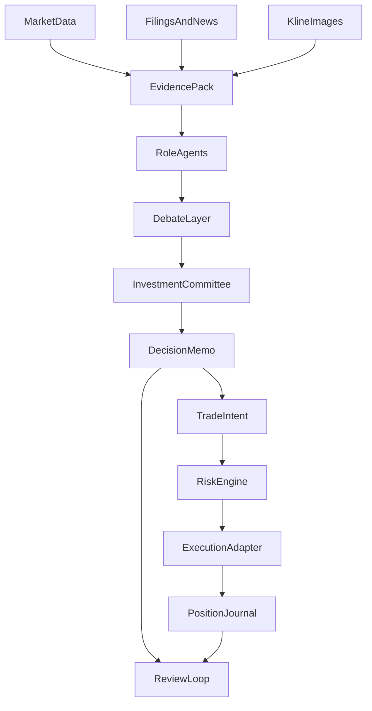

# 股票大师仓库方案

> 这是全局计划文件 `stock-master-architecture_d20b6876.plan.md` 的可读副本，放在当前仓库内，便于直接查看和后续迭代。

## 待办

- [ ] 先把第一个子项目收敛为“单股研究与决策闭环 MVP”，不要同时开做组合、执行、券商集成
- [ ] 定义核心领域对象和 schema：`ResearchRun`、`EvidenceItem`、`DecisionMemo`、`TradeIntent`、`ReviewLog`、`RiskRule`
- [ ] 确定 Python 引擎 + 本地 Web 驾驶舱 + Cursor CLI Provider 的技术边界与目录结构
- [ ] 把旧目录里的量化初筛、多模型调研、管理汇总流程重构为统一 `research pipeline`
- [ ] 确定 Git 文档、结构化数据库、原始数据文件三者各自保存什么
- [ ] 把真实下单能力放到后期，先定义 `paper trading` 和人工确认规则

## 推荐方向

我建议把这个仓库设计成一个 `本地优先 + 人类最终拍板 + AI 多角色协作` 的投资操作系统，而不是单纯的分析脚本库。

核心原则：

- `事实`、`判断`、`行动` 三层分离，避免模型把结论和证据混在一起。
- 先把 `研究流程标准化`，再做 `交易记录与组合管理`，最后才考虑 `半自动执行`。
- 所有重要结论都要可追溯到原始数据、来源链接、截图、公告或模型输出。
- 真正下单必须保留 `人工确认 + 风控规则 + 审计日志`，不要让模型直接越过你交易。

## 为什么这样设计

你之前的流程已经证明了两件事：

- 多模型交叉研究很有价值。
- 现在的主要问题不是“模型不够强”，而是缺少统一的证据底座、结构化产物、决策留痕和投后闭环。

基于你之前的 `stock-buy` 目录，最值得继承的是：

- 单股量化初筛思路：`stock_analyzer.py`
- 多模型分章节调研方式：如 `multi-agents/gpt5-4/`、`multi-agents/composer2/`
- 管理层汇总与最终决策文档：如 `manage-agents/opus4-6.md`

最需要修复的是：

- 各模型产物没有统一 schema，容易互相重复或自我强化。
- 量化打分、K 线观察、结论建议之间没有强约束，容易“分高但不该买”。
- 交易动作、仓位纪律、复盘结果没有进入同一个系统。

## 建议的总体架构

推荐采用 `Python 核心引擎 + 本地 Web 驾驶舱 + Cursor CLI / 多模型代理层` 的三层结构。

### 方案对比

1. `纯脚本仓库`
适合快速起步，但很快会变成文档堆和 prompt 堆，不适合长期跟踪与交易闭环。

2. `纯 Web 产品`
界面完整，但会过早投入 UI 与账户系统，反而拖慢研究流程沉淀。

3. `混合式投资操作系统`（推荐）
用 Python 负责数据、研究、风控和执行编排；用本地 Web 展示组合、研究结果、决策树和日志；用 Cursor CLI 或多模型适配器跑研究与辩论任务。

## 建议的仓库骨架

第一版建议按下面的边界来组织：

- `README.md`：项目目标、原则、风险声明、快速开始
- `docs/architecture.md`：整体架构与模块边界
- `docs/workflows/research-pipeline.md`：单股研究标准流程
- `docs/workflows/decision-journal.md`：决策、交易、复盘规范
- `apps/web/`：本地驾驶舱，展示自选股、研究结论、组合与交易日志
- `apps/api/`：本地 API，承接研究任务、日志写入、组合查询、风控检查
- `engine/data/`：行情、财务、公告、新闻、K 线图片等采集与标准化
- `engine/research/`：研究任务编排、提示词模板、角色代理、总结器
- `engine/portfolio/`：持仓、交易、资金曲线、复盘
- `engine/risk/`：仓位规则、止损、禁入条件、事件提醒
- `engine/execution/`：模拟下单、未来券商适配器
- `schemas/`：研究报告、决策 memo、交易记录、风控结果的结构化 schema
- `storage/`：本地数据库与文件产物目录
- `artifacts/`：每次研究运行生成的 Markdown、JSON、图表、截图与会议纪要
- `prompts/`：多模型角色 prompt 与输出模板

## 关键数据模型

建议从一开始就把下面这些对象定下来：

- `Ticker`：股票基本信息与市场属性
- `ResearchRun`：一次完整研究任务，绑定时间、模型、输入和产物
- `EvidenceItem`：原始事实，附带来源、抓取时间、可信度
- `ResearchMemo`：基本面/技术面/风险/估值等子报告
- `DebateRound`：多模型辩论记录，区分多头、空头、审慎派
- `DecisionMemo`：你的正式判断，记录买入逻辑、触发条件、失效条件、预期持有期
- `TradeIntent`：计划中的交易动作
- `TradeExecution`：真实成交记录
- `PositionSnapshot`：持仓快照与盈亏
- `ReviewLog`：复盘与 thesis 更新
- `RiskRule`：仓位上限、止损、黑名单、事件前后限制

## 推荐的数据与产物流

## 你的旧流程，建议升级成这样

你现在的流程大致是：

- 多个 AI 各自做调研
- 更强模型再总结
- 你再逐个沟通做决策

建议升级为 6 步：

1. `统一证据包`：先由系统把行情、财务、估值、公告、新闻、K 线截图整理成标准化输入。
2. `角色分工`：让不同模型只做明确角色，例如基本面分析师、技术面分析师、风险官、反方辩手、组合经理。
3. `结构化输出`：每个角色输出固定 JSON + Markdown，避免自由发挥后难以合并。
4. `对抗式汇总`：不是直接“总结”，而是先做共识/分歧表，再产出投资委员会 memo。
5. `你来拍板`：系统要求你填写理由、仓位、触发条件、认错条件，而不是只记录“买/不买”。
6. `投后跟踪`：研究结论自动进入监控清单，跟踪财报、公告、价格区间、 thesis 是否失效。

## Cursor CLI 在这个仓库里的角色

Cursor CLI `适合做研究编排层，但不应成为核心业务层的唯一依赖`。

适合它做的事：

- 用 `plan/ask/agent` 模式做研究、提问、交叉评审
- 用 `agent -p` 跑脚本化的总结、辩论、审稿任务
- 用 `resume` 续接某只股票的长期研究线程
- 用并行 agent / worktree 做多模型 Best-of-N 研究
- 读取本仓库里的规则、 prompt、历史产物和 MCP 配置

不适合完全交给它的事：

- 行情 ETL
- 定时任务与监控
- 风控规则判断
- 券商 API 执行
- 需要强一致性与可测试性的核心业务逻辑

所以建议设计一个 `ModelProvider` 抽象层：

- `CursorCliProvider`
- `OpenAIProvider`
- `GeminiProvider`
- `AnthropicProvider`

这样你在 Cursor 里可以继续用熟悉的方式跑研究，同时未来也能把同样的研究任务迁移到更稳定的 API 编排里。

## 分阶段路线图

### Phase 1：研究操作系统

目标：让每只股票都能形成标准化研究档案。

- 建立股票实体、研究任务、证据包、报告 schema
- 迁移你旧项目里的五维评分逻辑和章节化调研模板
- 形成“单股研究 -> 多模型辩论 -> 投资委员会 memo”的闭环

### Phase 2：决策与交易日志系统

目标：让每次想法、买卖和复盘都可追踪。

- 加入交易计划、成交记录、仓位变化、复盘日志
- 让研究结论和真实交易绑定
- 自动生成观察清单、下次复盘时间和 thesis 失效提醒

### Phase 3：组合与风险驾驶舱

目标：从单股研究升级到组合管理。

- 加入组合视图、风险暴露、行业集中度、回撤监控
- 支持策略模板，例如价值、成长、事件驱动、网格观察仓
- 给你一个“今天该看什么”的 dashboard

### Phase 4：模拟执行与券商适配预留

目标：先把执行流程跑通，再考虑真金白银。

- 先实现 `paper trading`
- 再实现下单指令校验、双确认、风控拦截
- 最后再考虑券商/API 真实执行，且默认关闭

## 关键设计原则

- `本地优先`：你的研究、决策、资金与交易数据尽量保存在本地。
- `Git 只管知识，不管高频状态`：研究文档、prompt、策略模板进 git；行情时序、持仓快照、交易流水进数据库。
- `先支持 A 股，再谈全球市场`：复用你已有的数据源与经验。
- `默认人工确认`：任何真实交易动作都必须经过你手动确认。
- `先跑模拟盘`：在真实执行前，先要求一段时间的 paper trading 观察。

## 我建议你在这个仓库里优先做的第一子项目

不要一上来做“全功能股票大师”。先做一个最有复利的核心：

`单股研究与决策闭环 MVP`

它只解决 4 件事：

- 输入一只股票，自动拉取证据与基础评分
- 并行调用多个模型做分角色研究
- 自动生成共识/分歧 + 投资委员会 memo
- 记录你的最终判断、计划仓位、触发条件与复盘日期

这个 MVP 一旦打稳，后面的交易日志、组合管理、模拟执行都会顺得多。

