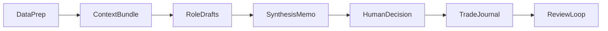

# 股票大师最终融合方案

## 融合原则

- 以 `[.cursor/plans/stock-master-architecture_d20b6876.plan.md](.cursor/plans/stock-master-architecture_d20b6876.plan.md)` 作为方向盘：坚持 `本地优先`、`事实/判断/行动分层`、`先单股研究闭环再扩展`。
- 以 `[.cursor/plans/stock_master_系统设计_7b38bddf.plan.md](.cursor/plans/stock_master_系统设计_7b38bddf.plan.md)` 作为工程骨架：采用 `[src/stock_master/](src/stock_master/)` 包结构、CLI 入口、SQLite 缓存、按日期组织研究产物。
- 以 `[.cursor/plans/stock_master_架构与工作流设计方案_bfb2ffe6.plan.md](.cursor/plans/stock_master_架构与工作流设计方案_bfb2ffe6.plan.md)` 作为日常工作流：AkShare 拉数、Cursor 多角色分析、强模型综合、交易与复盘留痕。
- 最终不走 `纯脚本仓库`，也不先做 `完整 Web 产品`；采用 `Python 核心引擎 + Cursor 工作台 + 文件/数据库双存储` 的混合路线。

## 最终架构

- 核心代码集中在 `[src/stock_master/](src/stock_master/)`：
  - `data/`：AkShare 拉数、SQLite 缓存、技术指标、上下文包生成。
  - `analysis/`：量化评分、技术面/基本面辅助计算、报告片段生成。
  - `pipeline/`：研究编排、模型 provider 抽象、综合输出。
  - `portfolio/`：交易意图、持仓聚合、复盘逻辑。
  - `models/`：`ResearchRun`、`EvidenceItem`、`DecisionMemo`、`TradeIntent`、`ReviewLog`、`RiskRule` 等核心领域对象。
- 人类可读资产保留在仓库根目录：
  - `[research/](research/)`：`{code}/{date}/context.md`、`agents/`、`synthesis.md`、`decision.md`。
  - `[journal/](journal/)`：`trades/*.yaml`、`entries/*.md`、`reviews/*.md`、`portfolio.yaml`、`watchlist.yaml`。
  - `[prompts/](prompts/)`：角色分析模板、综合模板、讨论模板。
  - `[strategies/](strategies/)`：策略模板、仓位纪律、失效条件范式。
  - `[.cursor/rules/](.cursor/rules/)`：最小规则集，至少包含全局项目规则和调研规则。
- 高频或可派生状态放在 `[storage/](storage/)`：
  - `stock_master.db`：行情缓存、研究索引、交易/持仓派生视图。
  - `[artifacts/](artifacts/)`：图表、截图、原始导出文件。
- `[apps/web/](apps/web/)` 与 `[apps/api/](apps/api/)` 只作为 Phase 3 以后的扩展，不作为 MVP 前提。

## 关键取舍

- `Cursor` 定位为 `研究工作台`，不是 ETL、风控和真实执行的唯一运行时。
- 结构化记录优先选 `YAML + Markdown`，保留手工可读与 Git diff 友好性；行情和缓存用 SQLite，避免把高频状态堆进 Git。
- 多模型调研先做 `半自动`：统一 `context.md` + 固定角色模板 + Cursor 多 Tab/Composer；`Cursor CLI` 或直接 API 的自动 dispatch 放到后续增强。
- 真实交易默认保留 `人工确认`；先支持 `TradeIntent` 和 `paper trading` 占位，再考虑券商接入，且默认关闭。

## 推荐工作流

- 第一步：通过 `sm data <code>` 或等价脚本生成该股票的统一 `context.md`。
- 第二步：在 Cursor 中用 `[.cursor/rules/](.cursor/rules/)` + `[prompts/](prompts/)` 生成多个角色草稿，落盘到 `[research/](research/)`。
- 第三步：用强模型生成 `synthesis.md`，先输出 `共识/分歧`，再给出 `decision.md` 草案。
- 第四步：由你确认 `DecisionMemo`，补齐仓位、触发条件、失效条件、复盘日期。
- 第五步：若进入交易，写入 `[journal/](journal/)` 的结构化记录和叙事日志，并在复盘时回链到原研究目录。

## 分阶段路线

- `Phase 1：单股研究与决策闭环 MVP`
  - 跑通 `拉数 -> context -> 多角色草稿 -> 综合 -> 决策`。
  - 只需要最小 CLI，例如 `sm data`、`sm score`。
  - 不同时启动组合管理、真实执行、完整 Web 控制台。
- `Phase 2：决策与交易日志`
  - 引入 `TradeIntent`、`research_ref`、`review_date`。
  - 建立 `journal/trades/`、`journal/entries/`、`journal/reviews/` 的追溯链。
- `Phase 3：组合与风险视图`
  - 做持仓聚合、观察清单、风险规则和简易仪表盘。
  - 只有在这一步才考虑 `[apps/web/](apps/web/)` 和 `[apps/api/](apps/api/)`。
- `Phase 4：自动化扩展`
  - 增加 provider 抽象、paper trading、可选的 Cursor CLI/API dispatch、未来券商适配。
  - 真实执行保持默认关闭，并继续保留人工确认关口。

## 首次落地边界

- 第一阶段必须收敛的对象只有：`ResearchRun`、`EvidenceItem`、`DecisionMemo`、`TradeIntent`、`ReviewLog`、`RiskRule`。
- 第一阶段成功标准：任意一只股票都能从数据准备走到 `decision.md`，并留下可追溯的下一次复盘时间。
- 当前明确延后：`全自动多模型调度`、`完整组合驾驶舱`、`真实券商接入`、`复杂风控引擎自动执行`。

