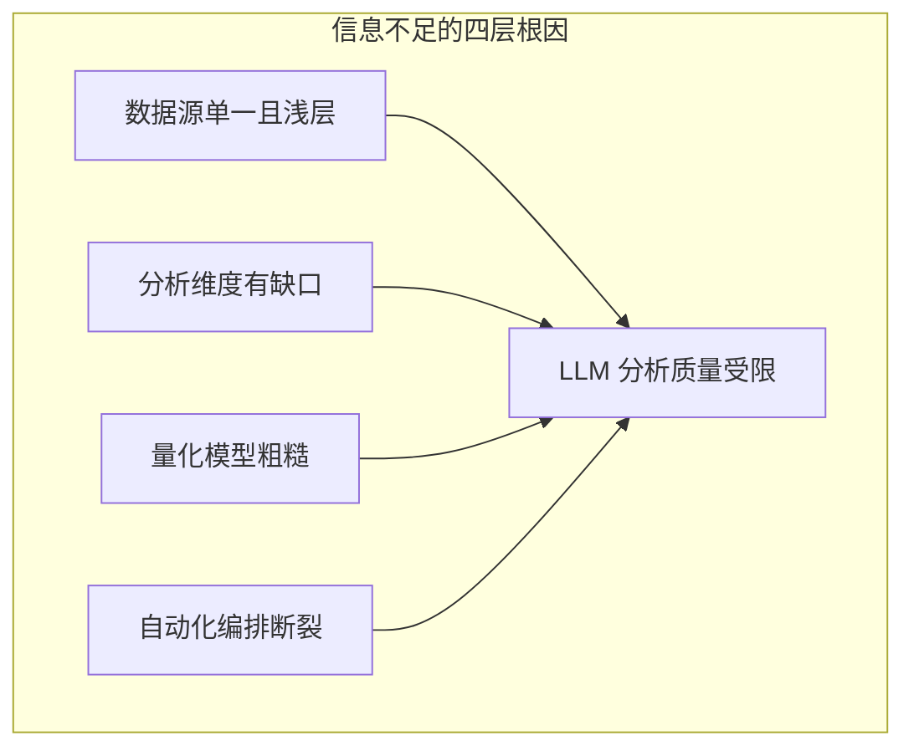
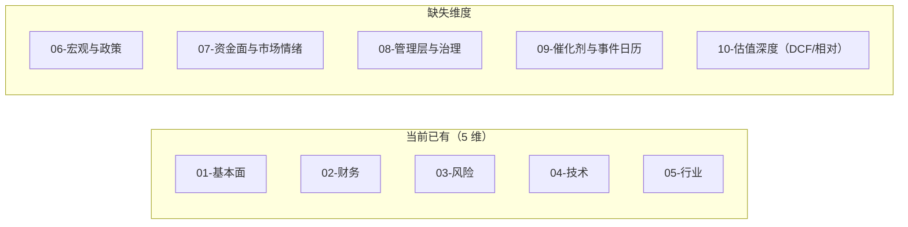

# 股票管理大师：调研不足问题诊断与改进方案

## 一、核心问题诊断

当前系统的"信息不足"问题可分解为 **四个层面**：

---

## 二、逐层诊断

### 层面 1：数据源单一且浅层

当前 **唯一数据源是 AkShare**，且只取了最基础的几类数据。

| 已有数据 | 实际情况                  | 缺失导致的后果                         |
| ---- | --------------------- | ------------------------------- |
| 基本信息 | 仅公司名/行业/上市日等          | LLM 对业务结构、收入构成一无所知              |
| K 线  | 港股经常拉取失败返回空 DataFrame | 技术面分析完全失效（见 09988 的 context.md） |
| 财务摘要 | 只有 5 年汇总级数据           | 无法做季度趋势、现金流质量、应收账款周转等深度分析       |
| 估值   | 当前 PE/PB/PS           | 无历史百分位，不知道当前估值在历史什么位置           |
| 新闻   | 仅标题列表，且常混入无关新闻        | 无法判断舆情倾向、无重大事件提取                |

**完全缺失的关键数据类型**（模型中 `EvidenceType` 已预留但从未实现）：

- **公告/公司披露**：年报/季报原文、重大事项、回购/增持公告
- **券商/分析师研报**：目标价、盈利预测、评级变动
- **资金流向**：主力资金、北向/南向资金、大单净流入
- **融资融券**：两融余额变化，可反映市场杠杆情绪
- **机构持仓**：基金持仓变动、十大股东变化
- **大股东/高管行为**：减持/增持、质押比例
- **宏观经济数据**：GDP、CPI、PMI、利率、社融等——当前系统 **零宏观数据**
- **行业可比数据**：同行业公司列表及其估值/财务对比数据

### 层面 2：分析维度有缺口

当前 5 个 prompt 维度：基本面 / 财务 / 风险 / 技术 / 行业

具体缺失：

- **宏观与政策维度**：无对应 prompt，无数据支撑。LLM 只能用训练知识中的过期宏观信息
- **资金面与市场情绪**：无资金流、融资融券、换手率异动等数据
- **管理层与公司治理**：prompt 里提了一句"管理层"但无对应数据支撑（高管薪酬、股权激励、关联交易等）
- **催化剂与事件日历**：风险 prompt 提到"催化剂时间线"但无业绩预告日、解禁日、分红日等结构化数据
- **估值深度分析**：财务 prompt 提到 DCF，但系统不提供自由现金流序列、WACC 假设等数据

### 层面 3：量化模型粗糙

`[src/stock_master/analysis/quantitative.py](src/stock_master/analysis/quantitative.py)` 存在多个问题：

- **"盈利能力"名不副实**：函数名 `score_profitability` 注释写"基于 ROE 和利润率"，实际只用了 PE 做分段打分，与 `score_valuation` 高度重叠
- **"成长性"仅看股价涨跌**：60 日涨幅不等于公司成长性，应该用营收/利润增速
- **缺乏行业对标**：所有打分使用绝对阈值（如 PE < 15 = 80 分），忽略了不同行业 PE 中枢差异巨大（银行 PE 5-8 vs 科技 PE 30-50）
- **数据源不够**：safety 只用波动率和回撤，缺少资产负债率、现金流覆盖等真正的财务安全指标

### 层面 4：自动化编排断裂

- **5 个维度分析全靠手动**：用户需要在 Cursor 中逐个 `@` 引用 prompt 和 context，跑 5 次对话
- **综合和决策也靠手动**：没有自动从 5 份报告生成 consensus-matrix 的编排
- `**sm suggest` 是组合级别**：虽然自动化程度高，但它跳过了单股深度研究，直接基于 context.md（已证明信息不足）给出组合建议
- **信息流单向**：LLM 无法在分析过程中请求补充数据（例如发现需要看季度数据时无法自动获取）

---

## 三、改进方案（分阶段）

### Phase A：数据层补强（优先级最高）

**目标**：让 `context.md` 从"骨架"变成"血肉丰满的研究包"

1. **扩展 `fetcher.py` 数据采集**（利用 AkShare 已有但未用的接口）：
  - 资金流向：`ak.stock_individual_fund_flow` / `ak.stock_individual_fund_flow_rank`
  - 融资融券：`ak.stock_margin_detail_szse` / `ak.stock_margin_detail_sse`
  - 十大股东/机构持仓：`ak.stock_main_stock_holder` / `ak.stock_institute_hold`
  - 大股东增减持：`ak.stock_inner_trade_xq`
  - 行业板块成分与排名：`ak.stock_board_industry_cons_em`
  - 可比公司估值对标（同行业取 top N）
  - 宏观指标：`ak.macro_china_gdp` / `ak.macro_china_cpi` / `ak.macro_china_pmi` 等
  - 业绩预告 / 快报：`ak.stock_yjyg_em`
2. **修复港股 K 线稳定性**：增加多源降级（目前港股 K 线只有一个数据源且经常失败）
3. **新闻过滤与质量提升**：
  - 过滤掉与目标股票无关的新闻（关键词匹配）
  - 抓取新闻正文而不仅是标题
  - 添加简单的情绪标签（利好/利空/中性）

### Phase B：分析维度扩充

1. **新增 prompt 模板**：
  - `06-macro-policy.md`：宏观经济与政策环境分析
  - `07-capital-flow.md`：资金面与市场情绪分析
  - `08-governance.md`：管理层与公司治理评估
  - `09-catalyst-calendar.md`：催化剂与事件日历
  - `10-valuation-deep.md`：深度估值分析（含 DCF 框架）
2. **修正量化评分体系**：
  - `score_profitability` 改用真实 ROE/净利率/毛利率
  - `score_growth` 改用营收增速 + 利润增速
  - 引入行业中位数对标（相对估值而非绝对阈值）
  - 增加"资金面"维度评分

### Phase C：自动化编排升级

1. **实现端到端自动研究管线**：
  - 新增 `sm deep-research <code>` 命令
  - 自动跑完所有维度（并行调用 agent）
  - 自动生成 consensus-matrix 和 investment-thesis
  - 最终仍由人类填写 decision.md
2. **支持 LLM 动态补充数据**（中长期）：
  - 提供工具调用接口让 LLM 在分析过程中请求特定数据
  - 例如分析中发现需要季度数据，可调用 fetch 获取

---

## 四、改进前后对比

改进前（当前 context.md 信息量）：

- 基本信息（10 项静态字段）
- 五维评分（基于不完整数据的粗糙分数）
- PE/PB/PS（当前值，无历史对比）
- K 线摘要（港股常为空）
- 5 年财务汇总（无季度、无现金流细节）
- 10 条新闻标题（常含无关内容）

改进后（目标 context.md 信息量）：

- 基本信息 + 业务分部收入结构
- 修正后的多维评分（含行业对标）
- PE/PB/PS 当前值 + 历史百分位 + 同行对比
- 完整 K 线 + 技术指标（多源保障可用性）
- 财务三表关键指标 + 季度趋势
- 资金流向 + 融资融券变化
- 十大股东 + 机构持仓变动
- 过滤后的相关新闻 + 情绪标签
- 宏观环境快照
- 催化剂日历（解禁日、业绩预告日等）
- 同行业 Top5 可比公司估值表

