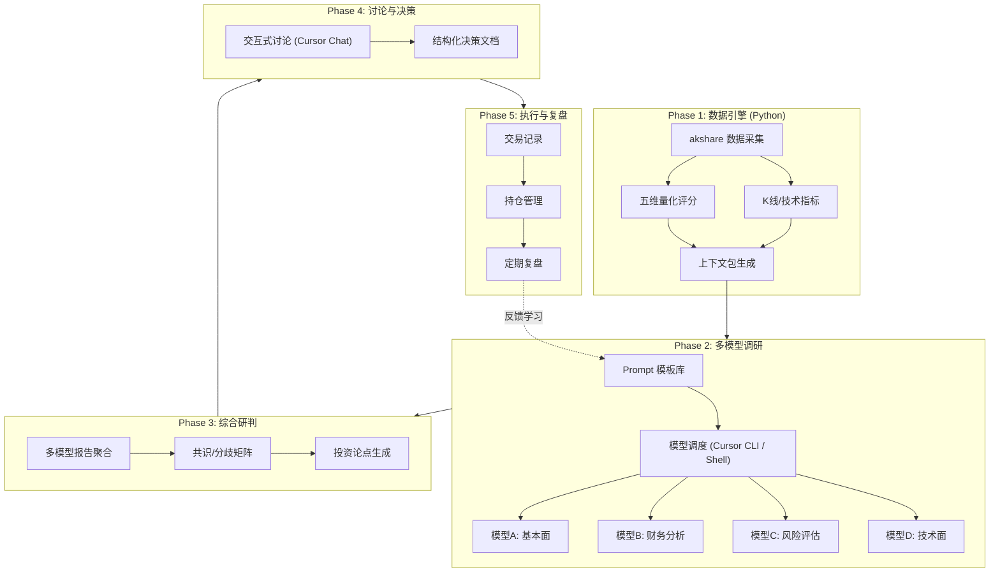
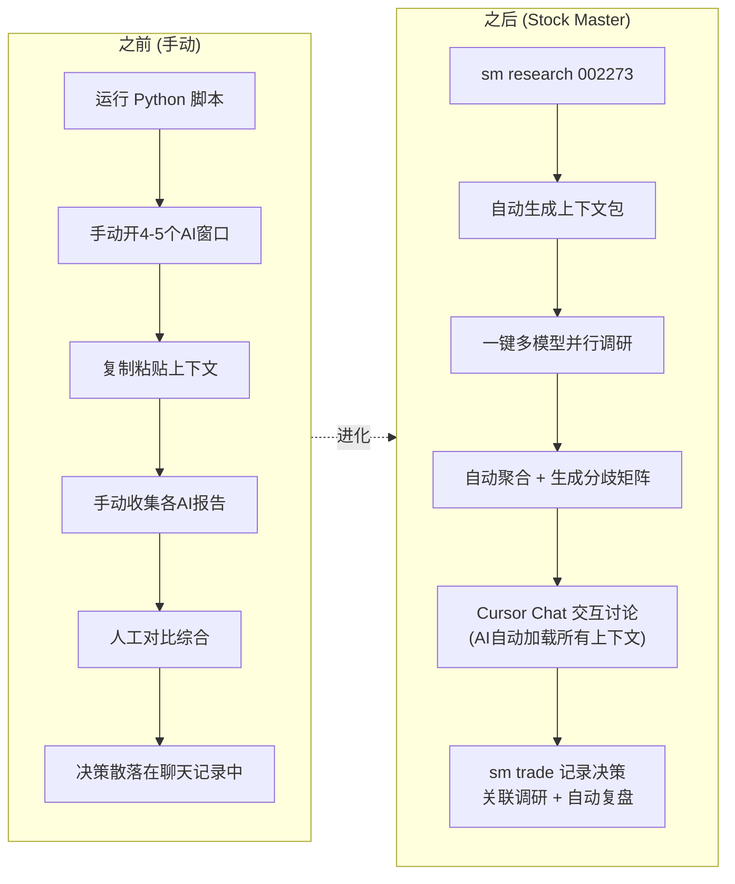

# Stock Master 系统设计方案

## 设计哲学

你的工作流本质上是一个 **"数据驱动 + 多视角AI辩论 + 人类裁决"** 的投资决策系统。当前的痛点是：手动在多个AI之间搬运上下文、缺少结构化的决策记录、无法回溯复盘。Stock Master 要解决这些问题。

---

## 系统架构




---

## 目录结构

```
kav/
├── README.md
├── pyproject.toml                       # uv/pip 项目配置
├── .cursor/
│   └── rules/
│       ├── stock-master.mdc             # 全局项目上下文规则
│       ├── research.mdc                 # 调研工作流规则
│       └── trading.mdc                  # 交易记录规则
│
├── src/stock_master/
│   ├── __init__.py
│   ├── cli.py                           # CLI 主入口 (click/typer)
│   ├── data/
│   │   ├── fetcher.py                   # akshare 数据采集 (复用/增强现有脚本)
│   │   ├── cache.py                     # SQLite 本地缓存层
│   │   └── indicators.py               # 技术指标计算 (MA/MACD/RSI/布林带)
│   ├── analysis/
│   │   ├── quantitative.py              # 五维评分 (迁移自 stock_analyzer.py)
│   │   ├── technical.py                 # K线形态识别 + 趋势判断
│   │   └── reporter.py                  # Markdown 报告生成器
│   ├── portfolio/
│   │   ├── tracker.py                   # 持仓状态管理
│   │   ├── trade_log.py                 # 交易记录 CRUD
│   │   └── reviewer.py                  # 复盘分析 (预测 vs 结果)
│   └── pipeline/
│       ├── context_builder.py           # 研究上下文包构建
│       └── orchestrator.py              # 多模型调度引擎
│
├── prompts/                             # AI 调研 Prompt 模板库
│   ├── README.md                        # 使用说明
│   ├── research/
│   │   ├── 01-fundamental.md            # 基本面分析 (商业模式/护城河/竞争格局)
│   │   ├── 02-financial.md              # 财务深度 (三表分析/盈利质量/现金流)
│   │   ├── 03-risk.md                   # 风险评估 (红旗/空头逻辑/黑天鹅)
│   │   ├── 04-technical.md              # 技术面 (趋势/支撑阻力/量价)
│   │   └── 05-industry.md               # 行业与竞争 (赛道/格局/催化剂)
│   ├── synthesis/
│   │   ├── consensus-matrix.md          # 多模型共识/分歧矩阵模板
│   │   └── investment-thesis.md         # 投资论点结构化模板
│   └── discussion/
│       ├── strategy-review.md           # 策略讨论模板
│       └── position-sizing.md           # 仓位管理讨论模板
│
├── research/                            # 调研成果 (按股票/日期组织)
│   └── {stock_code}/
│       ├── profile.yaml                 # 股票档案 (持续更新)
│       └── {YYYY-MM-DD}/
│           ├── context.md               # 自动生成的数据上下文
│           ├── agents/
│           │   ├── {model-name}.md      # 各模型调研报告
│           │   └── ...
│           ├── synthesis.md             # 综合研判
│           └── decision.md              # 最终决策
│
├── journal/                             # 交易日志
│   ├── portfolio.yaml                   # 当前持仓快照
│   ├── watchlist.yaml                   # 自选股 + 监控条件
│   ├── trades/                          # 交易记录
│   │   └── {YYYY-MM-DD}-{code}-{action}.yaml
│   └── reviews/                         # 复盘
│       └── {YYYY-MM-DD}-{weekly|monthly}.md
│
├── strategies/                          # 策略库
│   ├── README.md
│   └── {strategy-name}.md
│
└── scripts/
    ├── research.sh                      # 一键调研 pipeline
    └── dispatch-models.sh               # 多模型并行调度
```

---

## 核心模块详细设计

### 1. 数据引擎 (`src/stock_master/data/`)

从你现有的 `stock_analyzer.py` 进化而来，主要改进：

- **数据缓存**: 用 SQLite 缓存 akshare 数据，避免重复请求，支持离线分析
- **技术指标扩展**: 在现有五维评分基础上，增加 MA/MACD/RSI/布林带/KDJ 等技术指标计算
- **上下文包构建**: 自动将量化数据 + K线摘要 + 最新公告打包成结构化 Markdown，作为多模型调研的输入

CLI 用法设计：

```bash
# 生成研究上下文包
sm data 002273 --output research/002273/2026-03-30/context.md

# 五维评分
sm score 002273

# 多股对比
sm compare 002273 300346 603501
```

### 2. 多模型调研 Pipeline (`prompts/` + `scripts/`)

**这是对你现有流程最大的改进。**

你之前的流程：手动打开4-5个AI会话 -> 手动粘贴上下文 -> 手动收集报告

改进后：

```bash
# 一键启动完整调研
sm research 002273

# 等价于依次执行：
# 1. 生成上下文包 (context.md)
# 2. 并行调度多模型 (通过 Cursor CLI 或直接 API)
# 3. 收集报告到 research/{code}/{date}/agents/
# 4. 触发综合研判
```

**关于 Cursor CLI 的集成方案：**

Cursor CLI 目前支持 `cursor` 命令行操作。我们可以探索两种调度方式：

- **方案 A (Cursor CLI)**: 利用 `cursor --cli` 的 agent 模式，将 prompt + 上下文文件发送给不同模型。优点是与你的 Cursor 工作流无缝集成。
- **方案 B (直接 API)**: 用 Python 直接调用 OpenAI/Anthropic/Google API，更可控但需要管理 API key。
- **方案 C (混合)**: 数据采集和简单分析用 Python API 自动化，深度分析用 Cursor CLI 交互式完成。

建议先实现方案 C，因为深度调研需要你参与讨论，纯自动化反而会丢失思考过程。

### 3. Prompt 模板库 (`prompts/`)

每个 prompt 模板的结构：

```markdown
# {分析维度} 分析指令

## 你的角色
{角色定义，比如"资深财务分析师"}

## 分析对象
{{stock_name}} ({{stock_code}})

## 输入数据
{{context}}  ← 自动注入上下文包内容

## 分析框架
{具体的分析步骤和要求}

## 输出格式
{标准化的输出结构}
```

这样做的好处：

- 每个模型的 prompt 可以独立迭代优化
- 输出格式标准化，方便后续综合
- 上下文自动注入，不用手动复制粘贴

### 4. 交易记录系统 (`journal/`)

**portfolio.yaml 结构**：

```yaml
updated_at: 2026-03-30
total_invested: 100000
cash: 45000
positions:
  - code: "002273"
    name: "水晶光电"
    shares: 500
    avg_cost: 23.15
    current_price: 23.50
    research_ref: "research/002273/2026-03-29"
    strategy: "分批建仓-等年报"
    stop_loss: 17.00
    take_profit: 30.00
    notes: "15%底仓，等年报后决定是否加仓"
```

**trade log 结构**：

```yaml
date: 2026-03-30
code: "002273"
name: "水晶光电"
action: buy
price: 23.15
shares: 500
amount: 11575
reason: "底仓建仓，占总资金15%"
research_ref: "research/002273/2026-03-29/decision.md"
confidence: 6  # 1-10
tags: [分批建仓, 年报前布局]
review_date: 2026-04-18  # 年报后复盘
```

CLI 用法：

```bash
# 记录交易
sm trade buy 002273 --price 23.15 --shares 500 --reason "底仓建仓"

# 查看持仓
sm portfolio

# 触发复盘
sm review weekly
```

### 5. Cursor Rules 设计 (`.cursor/rules/`)

这是让 Cursor 内的 AI 自动理解你的项目上下文的关键。

**stock-master.mdc** (全局规则):

- 告诉 AI 这是一个个人股票投资决策系统
- 说明目录结构和各模块职责
- 定义常用命令和工作流
- 链接到持仓和自选股数据

**research.mdc** (调研规则):

- 在分析股票时自动加载该股票的历史研究
- 提醒 AI 使用标准化的分析框架
- 引导 AI 生成与现有报告格式一致的输出

**trading.mdc** (交易规则):

- 记录交易时自动关联调研报告
- 强制执行风控纪律（止损线、仓位限制等）
- 复盘时自动对比当时预测与实际结果

---

## 改进的工作流 (vs 你的现有流程)




**关键改进点：**

- 上下文自动打包注入，消灭"复制粘贴"
- Prompt 模板标准化，每次调研质量一致
- 决策全链路可追溯：数据 -> 调研 -> 综合 -> 决策 -> 交易 -> 复盘
- Cursor Rules 让 AI 自动加载项目上下文，不用每次重新解释
- 结构化的复盘机制：当时怎么想的、后来发生了什么、下次怎么改

---

## 技术栈

- **语言**: Python 3.12+
- **包管理**: uv (快速、现代)
- **数据**: akshare + SQLite (缓存) + pandas
- **CLI**: typer (比 argparse 更现代，自动生成帮助文档)
- **输出**: rich (终端美化，复用现有)
- **配置/数据**: YAML (人类可读可编辑)
- **报告**: Markdown (与 Cursor/Git 天然兼容)
- **图表**: matplotlib (K线图) 或后续考虑 plotly

---

## 实施路线

分四个阶段，每个阶段都产出可用的功能：

### Phase 1: 基础框架 + 数据引擎

搭建项目骨架，迁移并增强 `stock_analyzer.py`，实现 `sm data` / `sm score` 命令。

### Phase 2: 调研 Pipeline + Prompt 模板库

设计完整的 prompt 模板集，实现上下文包自动生成，探索 Cursor CLI 多模型调度。

### Phase 3: 交易记录 + 持仓管理

实现 `sm trade` / `sm portfolio` / `sm review`，建立决策追溯链。

### Phase 4: Cursor 深度集成

编写 Cursor Rules，创建自定义 Skills，打通 Cursor Chat 与研究数据的上下文链路。