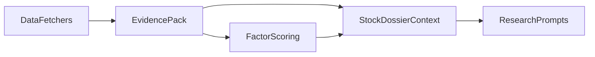

# 个股研究能力增强计划

## 问题诊断

- 当前自动化上下文主要来自 [src/stock_master/pipeline/context_builder.py](src/stock_master/pipeline/context_builder.py)。它只汇总了基本信息、K 线、估值、财务摘要、新闻、五维评分和技术面快照，缺少公告、资金面、行业对比、事件时间轴、一致预期、风险事件等关键证据层。
- 当前数据入口集中在 [src/stock_master/data/fetcher.py](src/stock_master/data/fetcher.py)。现有实现主要覆盖 `stock_individual_info_em`、`stock_zh_a_hist` / `stock_hk_hist`、财务摘要、估值和最多 10 条新闻，导致输入面天然偏窄。
- 当前五维评分在 [src/stock_master/analysis/quantitative.py](src/stock_master/analysis/quantitative.py) 中存在语义偏差：`成长性` 主要看股价涨幅和均线，`盈利能力` 实际主要看 PE，而不是财务质量。用户会误以为系统做了完整基本面分析，实际更接近“价量 + 估值”的简化打分。
- 当前研究模板对输入的要求高于系统真实供给。比如 [prompts/research/02-financial.md](prompts/research/02-financial.md) 期待 ROIC、自由现金流、历史分位、同行对比；[prompts/research/05-industry.md](prompts/research/05-industry.md) 期待赛道、竞争格局、催化剂、可比公司。但这些结构化数据并没有在 `context.md` 中自动提供，容易让模型补空白、降低可信度。
- 当前产品形态仍是 CLI + Markdown 工作流，见 [README.md](README.md) 与 [docs/architecture.md](docs/architecture.md)。它适合研究留痕，但不适合做“一个股票的完整研究工作台”，信息组织和上下文衔接偏弱。

## 目标

- 为 A 股和港股都建立更完整的“个股研究档案”，让系统先把事实层做厚，再让模型做判断层。
- 让评分名称、评分逻辑、报告结构三者一致，避免“看起来全面，实际依据单薄”。
- 让系统明确区分“已有证据”“缺失证据”“市场差异导致暂不可得证据”，降低模型幻觉和用户误判。

## 目标结构

## 分阶段方案

### 第一阶段：补齐事实层输入

- 扩展 [src/stock_master/models/research.py](src/stock_master/models/research.py)，把证据类型从 `MARKET_DATA / FINANCIAL / NEWS` 扩展到更贴近研究语义的结构，例如：公告、资金面、行业/可比公司、事件、风险标记、预期/一致预期。
- 扩展 [src/stock_master/data/fetcher.py](src/stock_master/data/fetcher.py)，优先补最能提升研究质量的 4 类数据：公告、行业/可比公司、资金面、关键事件时间轴。A 股和港股分别走各自可行的数据源，并统一为同一份中间结构。
- 扩展 [src/stock_master/data/cache.py](src/stock_master/data/cache.py)，让财务、新闻和新增证据也进入缓存，避免反复拉取导致结果不稳定。
- 重构 [src/stock_master/pipeline/context_builder.py](src/stock_master/pipeline/context_builder.py)，把 `context.md` 从“若干段文本拼接”升级为稳定章节的个股档案：公司画像、商业模式、财务质量、估值、技术面、资金面、行业/可比、事件/公告、主要风险、研究缺口。

### 第二阶段：重构分析框架与评分解释

- 重构 [src/stock_master/analysis/quantitative.py](src/stock_master/analysis/quantitative.py)，把当前五维评分改成更可解释的多层结构。建议至少拆成：基本面质量、成长兑现、估值位置、技术趋势、风险暴露。
- 把“技术因子”和“基本面因子”彻底分开，避免把 60 日涨幅误命名为成长性，把 PE 误命名为盈利能力。
- 每个评分维度必须输出因子解释和缺失字段提示，便于 [src/stock_master/analysis/reporter.py](src/stock_master/analysis/reporter.py) 在报告中展示“为什么给这个分”。

### 第三阶段：对齐 Prompt 与事实输入

- 校准 [prompts/research/02-financial.md](prompts/research/02-financial.md)、[prompts/research/05-industry.md](prompts/research/05-industry.md) 以及其他研究模板，让提示词只要求系统真实提供的证据，或者显式要求模型标注“该项缺少结构化数据，仅作假设分析”。
- 让研究模板优先消费结构化证据，而不是直接对整段 `context.md` 泛化推断。
- 在 [src/stock_master/analysis/reporter.py](src/stock_master/analysis/reporter.py) 中加入“已覆盖 / 未覆盖”清单，让用户一眼看出本次研究是不是完整。

### 第四阶段：优化信息组织与研究流程

- 在 [src/stock_master/cli.py](src/stock_master/cli.py) 中重新定义“生成研究上下文”的用户入口，至少让单股研究支持更完整的档案式输出；后续可再考虑增加同业对比或研究摘要命令。
- 更新 [README.md](README.md) 与 [docs/architecture.md](docs/architecture.md)，把“事实层 → 判断层 → 决策层”的实际能力边界写清楚，也把 A 股/港股支持差异写清楚。
- 如果仍维持 CLI + Markdown 形态，优先把 `research/<code>/<date>/context.md` 做成真正可读的个股主页；Web 工作台可以留在后续阶段，而不是当前第一优先级。

## 验收标准

- 单只股票的 `context.md` 至少能清楚回答：这家公司是什么、财务质量如何、估值处于什么位置、行业里和谁比、近期有什么事件、有哪些关键风险、还缺什么证据。
- 模型输出里不再把“缺数据”伪装成“有结论”；缺失项必须显式暴露。
- A 股与港股都能跑通同一套研究骨架，但允许市场特有字段缺省。
- 分数、章节标题、实际因子来源三者一致，用户能看懂每个结论是由哪些证据支持的。

