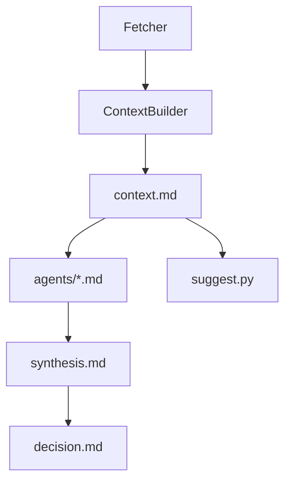

# 个股调研补强方案

## 当前诊断

当前系统的问题不只是“模型分析不够深入”，而是**事实层输入偏薄、研究结果没有回流、评分语义不够可靠**，导致后续模型即使多轮分析，也容易建立在不完整信息上。

### 1. 事实层输入过薄

- [src/stock_master/pipeline/context_builder.py](src/stock_master/pipeline/context_builder.py) 当前只把 `基本信息 / 五维评分 / 估值 / 30日行情 / 技术快照 / 财务摘要 / 新闻标题` 写入 `context.md`。
- [src/stock_master/data/fetcher.py](src/stock_master/data/fetcher.py) 的数据源主要集中在 AkShare 的基础接口，缺少公告、财报原文、股东/减持/质押、资金流、业绩日历、可比公司对标、行业景气等关键证据。
- [src/stock_master/analysis/reporter.py](src/stock_master/analysis/reporter.py) 会把新闻压缩成“标题 + 来源 + 时间”，新闻正文和链接没有进入最终上下文，模型很难基于事件细节做判断。

```python
sections = [
    format_stock_info(info),
    format_score_summary(score),
    format_valuation_summary(valuation),
    format_kline_summary(kline),
    _format_tech_snapshot(trend, sr, vol_signal),
    format_financial_summary(financial),
    format_news_summary(news),
]
```

### 2. 研究模板问得很深，但输入并不支撑

- [prompts/research/01-fundamental.md](prompts/research/01-fundamental.md) 要求分析商业模式、护城河、竞争格局、管理层。
- [prompts/research/02-financial.md](prompts/research/02-financial.md) 要求 ROIC、现金流质量、收入质量、历史分位与同行对比。
- [prompts/research/03-risk.md](prompts/research/03-risk.md) 和 [prompts/research/05-industry.md](prompts/research/05-industry.md) 要求红旗、催化剂时间线、可比估值、产业链关系。

但这些问题目前大多没有结构化事实输入，结果往往只能依赖模型补全常识，不能保证“调研充分”。

### 3. 研究链路没有闭环

- [src/stock_master/pipeline/orchestrator.py](src/stock_master/pipeline/orchestrator.py) 只负责创建 `agents/`、`synthesis.md`、`decision.md` 模板。
- [src/stock_master/pipeline/suggest.py](src/stock_master/pipeline/suggest.py) 在组合建议阶段只读取 `context.md` 和 `portfolio.yaml`，并不会把 `agents/*.md` 或 `synthesis.md` 纳入输入。
- [src/stock_master/models/research.py](src/stock_master/models/research.py) 已经定义了 `EvidenceItem`、`ResearchMemo`、`ResearchRun`，说明架构上预留了“证据化研究”的方向，但还没有真正接入流程。

```python
for code in bundle.codes:
    ctx = bundle.contexts.get(code, "（无上下文）")
    parts.append(f"### {code}\n")
    parts.append(ctx)
```

这意味着系统现在更像是“对同一份薄上下文反复提问”，而不是“让研究过程不断累积、沉淀和复用”。

### 4. 评分体系容易制造“信息完整”的错觉

- [src/stock_master/analysis/quantitative.py](src/stock_master/analysis/quantitative.py) 中，`growth`、`safety`、`momentum` 主要来自 K 线；K 线不足时默认退回 `50`。
- 同一文件中的 `score_profitability()` 注释写的是“基于 ROE 和利润率”，但实现实际主要依据 `PE`。
- 这会让“数据缺失”和“中性判断”混在一起，用户看到分数时不容易意识到其实证据并不完整。

### 5. 真实样例已经暴露出信息断档

- [research/09999/2026-04-01/context.md](research/09999/2026-04-01/context.md) 有估值和财务，但没有 K 线，技术面直接退化为 `N/A`。
- [research/300920/2026-04-01/context.md](research/300920/2026-04-01/context.md) 缺基本信息和估值，财务摘要里还出现 `False` 这样的异常值。

## 当前流程图




当前最大问题是：`agents/*.md` 和 `synthesis.md` 生成后，没有再进入 `suggest.py` 的输入链路。

## 改进方向

### 方向 A：补齐事实层证据

优先扩展 [src/stock_master/data/fetcher.py](src/stock_master/data/fetcher.py) 与 [src/stock_master/pipeline/context_builder.py](src/stock_master/pipeline/context_builder.py)，至少系统化纳入：

- 公告与财报事件
- 股东/治理/减持/质押
- 资金面与筹码面
- 可比公司与行业对标
- 业绩日历、催化剂、风险事件
- 更完整的新闻内容摘要，而不是只有标题

### 方向 B：把 `context.md` 从“摘要堆叠”升级为“研究事实包”

重构 [src/stock_master/analysis/reporter.py](src/stock_master/analysis/reporter.py) 的输出组织，让 `context.md` 明确区分：

- 核心事实
- 待验证假设
- 关键风险
- 近期催化剂
- 同行对标
- 数据缺失告警

目标不是让文件更长，而是让后续模型更容易抓住“该分析什么、哪些地方证据不足”。

### 方向 C：让研究结果真正回流

围绕 [src/stock_master/models/research.py](src/stock_master/models/research.py)、[src/stock_master/pipeline/orchestrator.py](src/stock_master/pipeline/orchestrator.py)、[src/stock_master/pipeline/suggest.py](src/stock_master/pipeline/suggest.py) 建立闭环：

- 把 `agents/*.md` 解析为结构化 `ResearchMemo`
- 把 `synthesis.md` 提炼为共识/分歧
- 在 `sm suggest` 中把“原始事实 + 分角色研究 + 综合结论”一起送入模型

### 方向 D：把“数据缺失”和“中性评分”分开

在 [src/stock_master/analysis/quantitative.py](src/stock_master/analysis/quantitative.py) 中重新定义评分语义：

- 缺失数据时不要默认伪装成 `50`
- 给每个维度附上证据来源与覆盖度
- 让盈利能力真正使用财务指标，而不是主要依赖 PE

## 建议的执行顺序

1. 先补 `fetcher + context_builder + reporter`，解决“输入不足”。
2. 再补 `orchestrator + suggest + models/research`，解决“研究结果不复用”。
3. 最后修正 `quantitative.py`，解决“评分可信度和可解释性”。

## 关键结论

- 现在的不足，**首要不是模型能力不够，而是输入事实包不够厚、也不够结构化**。
- 其次是**研究过程没有沉淀成可复用资产**，所以每次分析都像重新开始。
- 如果只继续优化提示词，不先补数据和链路闭环，信息不足的问题会持续存在。

