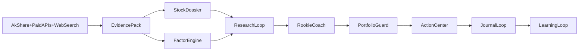

# Stock Master 新手稳健增值升级方案

**目标**：把 `stock_master` 从“单股调研辅助工具”升级为“面向股票小白的稳健增值操作系统”。核心不是承诺暴富，而是通过更厚的事实层、更强的风险约束、更清晰的买卖纪律和持续复盘，提高长期胜率并减少大亏。

## 为什么这样做

- 仓库现有主骨架已经成立：`[README.md](README.md)` 的“事实 / 判断 / 行动”分层、`[src/stock_master/pipeline/suggest.py](src/stock_master/pipeline/suggest.py)` 的多模型综合、`[src/stock_master/portfolio/reviewer.py](src/stock_master/portfolio/reviewer.py)` 的复盘入口、`[src/stock_master/models/research.py](src/stock_master/models/research.py)` 预留的 `EvidenceItem` / `ResearchMemo` 都说明方向是对的。
- 6 份现有计划的共识非常明确：`[src/stock_master/pipeline/context_builder.py](src/stock_master/pipeline/context_builder.py)` 当前只拼接基础信息、评分、估值、K 线、技术、财务、新闻，导致输入证据太薄、评分失真、研究不闭环。
- 外部最佳实践也指向同一件事：SEC 持续强调分散、仓位与再平衡；近两年的散户研究反复指出“过度交易 + 集中持仓”会显著拖累收益；成熟平台如 Stockopedia 把一页式报告、QVM 因子、组合分析和告警放在核心位置；付费数据方面可优先评估 iFinD / Choice，Wind 作为高配方案。

## 路线选择

- 路线 A：数据补洞版。只增强 `[src/stock_master/data/fetcher.py](src/stock_master/data/fetcher.py)`、`[src/stock_master/analysis/quantitative.py](src/stock_master/analysis/quantitative.py)`、`[src/stock_master/pipeline/context_builder.py](src/stock_master/pipeline/context_builder.py)`。优点是开发快，缺点是仍然更像“会写研报的脚本”，对新手赚钱帮助有限。
- 路线 B：新手投研教练版。除了补数据和评分，还要新增买点检查、仓位纪律、组合风险、复盘反馈和学习路径。最适合你现在的“稳健增值 + 新手”目标。
- 路线 C：准专业投顾版。路线 B 基础上接入付费数据、实时提醒、模拟盘和事件驱动监控。价值更高，但工程与成本明显上升。
- **推荐**：采用“B 为主干，C 的数据与提醒能力前置”的混合路线，不优先做真实自动交易。

## 目标架构

## Phase 1：把事实层做厚，先解决“瞎分析”

- 统一证据层：以 `[src/stock_master/models/research.py](src/stock_master/models/research.py)` 为起点，落地 `EvidencePack` / `StockDossier`，让公告、估值历史、季度趋势、现金流、资金流、机构持仓、分析师评级、事件日历、宏观与行业对标都成为标准化证据，而不是零散 Markdown。
- 数据层升级：重点改造 `[src/stock_master/data/fetcher.py](src/stock_master/data/fetcher.py)` 和 `[src/stock_master/data/cache.py](src/stock_master/data/cache.py)`，优先补齐港股 K 线回退、历史估值分位、完整财务与季度趋势、主力/北向/南向资金、股东变化、公告/业绩预告/研报摘要、行业对标、宏观快照。
- 付费数据接口抽象：不要把 iFinD / Choice / Wind 直接写死进现有函数，应该在 `[src/stock_master/pipeline/providers.py](src/stock_master/pipeline/providers.py)` 或新增 provider 层做“免费源 / 付费源 / 搜索源”可切换路由。
- 事实覆盖度必须显式化：在 `[src/stock_master/analysis/reporter.py](src/stock_master/analysis/reporter.py)` 和 `[src/stock_master/pipeline/context_builder.py](src/stock_master/pipeline/context_builder.py)` 中输出“已覆盖 / 缺失 / 时效性不足”清单，强制模型知道自己缺什么。

## Phase 2：重做评分体系，让分数真的能指导赚钱

- 用“质量 Quality / 估值 Value / 趋势 Trend / 风险 Risk / 催化剂 Catalyst”替代当前语义混乱的五维，重构 `[src/stock_master/analysis/quantitative.py](src/stock_master/analysis/quantitative.py)`。
- 所有评分都要区分“没有数据”与“中性结果”，不能再用默认 `50` 掩盖空白。
- 每个分数都要附因子解释、同行分位、历史分位和可信度，让新手知道“为什么能买、为什么不能买”。
- 评分输出不只服务单股，还要成为后续筛股、排序、预警和组合控制的统一底座。

## Phase 3：把仓库升级成“新手投研教练”

- 在 `[prompts/research/01-fundamental.md](prompts/research/01-fundamental.md)` 到 `[prompts/research/05-industry.md](prompts/research/05-industry.md)` 基础上新增宏观、资金、催化剂、治理、估值深挖模板，并让 `[src/stock_master/pipeline/orchestrator.py](src/stock_master/pipeline/orchestrator.py)` 自动扫描模板目录。
- 为每只股票生成一页式 `StockReport`，核心只回答 8 个问题：公司做什么、为什么可能涨、为什么可能跌、当前贵不贵、近期催化剂、最大风险、买入前还缺什么、这票适合什么仓位和持有周期。
- 在 `[src/stock_master/pipeline/suggest.py](src/stock_master/pipeline/suggest.py)` 中把 `context.md`、`agents/*.md`、`synthesis.md`、持仓状态、风险预算一起送入模型，形成“原始事实 + 研究结论 + 组合上下文”的闭环。
- 在 `[src/stock_master/cli.py](src/stock_master/cli.py)` 增加更贴近新手决策的入口，例如 `sm dossier`、`sm watchlist`、`sm check-buy`、`sm weekly-review`，而不只是 `sm data` / `sm suggest`。

## Phase 4：先防大亏，再谈大赚

- 利用 `[src/stock_master/portfolio/tracker.py](src/stock_master/portfolio/tracker.py)`、`[src/stock_master/portfolio/reviewer.py](src/stock_master/portfolio/reviewer.py)` 和 `journal/portfolio.yaml` 增加组合层规则：单票上限、行业集中度、主题重复暴露、回撤阈值、现金比例、再平衡提醒。
- 在买入前强制检查：是否过度集中、是否追涨、是否与现有持仓高度同质、是否缺关键证据、失效条件是否清楚。
- 在卖出后回写“为什么买、为什么卖、后来发生了什么、错在哪”，让系统逐步识别你的常见错误，比如追热点、补跌股、过早止盈、死扛亏损。
- 把“过度交易”和“注意力驱动选股”当成核心要防的用户行为，而不是让系统单纯给更多买卖点。

## Phase 5：做真正能帮新手赚钱的提醒系统

- 基于付费数据与联网搜索，新增公告 / 业绩 / 评级 / 资金 / 估值异动提醒，而不是只在你主动运行命令时才看到机会。
- 观察清单要区分三类：能立刻研究、需要等价格、暂时回避。提醒内容也要区分“机会提醒”和“风险提醒”。
- 把 `sm suggest` 从“给建议”升级成“按组合约束给建议”，输出要包含仓位建议、风险来源、替代标的、若不买更好的等待条件。
- 如果后续做 Web 端，优先做组合风险与观察清单，而不是花哨图表；对新手最值钱的是少犯错，不是更多仪表盘。

## Phase 6：建立学习飞轮，而不是只给结论

- 借鉴成熟平台的 Academy / checklist 思路，把系统变成“教练 + 工具”：每次分析都输出一个简短教学段，解释关键指标和本次最应该学会的东西。
- 新增模拟盘 / 纸上交易，而不是先做真实自动下单；先验证纪律是否能执行，再谈扩大资金。
- 把历史交易和研究转成个人化规则库，逐步形成“什么类型的票你做得好、什么类型你容易亏”的个体画像。
- 更新 `[README.md](README.md)` 和 `[docs/architecture.md](docs/architecture.md)`，明确系统目标从“股票大师”升级为“新手稳健增值操作系统”。

## 不要优先做的事

- 不要先做真实自动交易。
- 不要先堆更多大模型而不补事实层。
- 不要先做大而全的网页前端而忽略组合风控和复盘闭环。
- 不要把“收益最大化”理解成“更激进”，你的目标应该是“先把大错犯少，再把大机会抓住”。

## 成功标准

- 任何一只股票都能用系统回答“能不能买、为什么买、仓位多大、错了何时认错”。
- `sm suggest` 输出开始真正考虑组合层约束，而不是只看单股故事。
- 研究报告里“缺数据”的地方会明确暴露，不再伪装成完整判断。
- 复盘系统能识别并量化你的行为偏差，帮助你逐步减少无效交易。
- 在 paid data 打开后，系统具备接近专业投研平台的事实层，但仍保持“AI 给候选方案，人类拍板”的原则。

