# Stock Master 调研体系不足诊断

## 一、问题总览：Prompt 要求 vs 实际数据的断层

当前系统的核心矛盾在于：**Prompt 模板写得很专业、要求很全面，但 `context.md` 提供给 LLM 的实际数据远远跟不上 Prompt 的分析要求**。LLM 只能凭空"编造"或泛泛而谈，导致输出看似完整实则缺乏真实数据支撑。

```mermaid
flowchart LR
  subgraph current ["当前 context.md 实际提供的数据"]
    A1["公司简介"]
    A2["日K线 + 5个指标"]
    A3["PE/PB/PS 最新值"]
    A4["财务摘要 5行"]
    A5["10条新闻标题"]
    A6["五维评分"]
    A7["趋势/支撑阻力/量价"]
  end

  subgraph expected ["Prompt 要求 LLM 分析的内容"]
    B1["护城河/竞争格局/管理层"]
    B2["现金流/三张报表/应收"]
    B3["DCF/历史估值分位/同行对比"]
    B4["行业空间/渗透率/产业链"]
    B5["资金流向/融资融券/北向"]
    B6["公告/研报/机构观点"]
    B7["政策风险/宏观环境"]
    B8["舆情/社交媒体情绪"]
  end

  current -->|"巨大鸿沟"| expected
```

---

## 二、六大不足分类详解

### 不足 1：数据源单一且浅层

当前**只依赖 AkShare 一个数据源**（底层对接东方财富），且只用了其中很少的接口：

| 现有数据   | 实际接口                                 | 缺失的关键数据                  |
| ------ | ------------------------------------ | ------------------------ |
| 公司基本信息 | `stock_individual_info_em`           | 十大股东、股本结构、解禁日历           |
| 日K线    | `stock_zh_a_hist`                    | 分钟线、周线/月线多周期、复权模式选择      |
| 估值     | `stock_a_indicator_lg`（最新一行）         | **历史估值序列/分位数**、EV/EBITDA |
| 财务     | `stock_financial_abstract_ths`（5行摘要） | **完整三张报表**、季度数据、现金流明细    |
| 新闻     | `stock_news_em`（10条）                 | 公告全文、研报摘要、舆情平台           |

**AkShare 本身其实提供了大量可用接口没有接入**，例如：

- `stock_fund_flow_individual` — 个股资金流向
- `stock_hsgt_north_net_flow_in_em` — 北向资金
- `stock_margin_detail_szse` — 融资融券
- `stock_financial_report_sina` — 完整财务报表
- `stock_analyst_rating_em` — 机构评级
- `stock_individual_fund_flow_rank` — 资金排行

### 不足 2：五维量化评分体系粗糙

当前评分逻辑（[quantitative.py](src/stock_master/analysis/quantitative.py)）存在严重的"名不副实"问题：

- **"成长性"评分**：只看 60 天股价涨幅 + MA20 位置。**完全不看营收/利润增速**——这才是真正的成长性。
- **"盈利能力"评分**：只用 PE 做简单区间映射。**完全不看 ROE、毛利率、净利率**——这才是盈利能力。
- **"安全性"评分**：只看价格波动率和回撤。**不看资产负债率、流动比率、有息负债**——这才是财务安全。
- **"估值"评分**：只看 PE + PB 绝对值。**不看历史分位、同行对比、PS/PEG**——估值需要相对视角。
- **"动量"评分**：只看 5/20 日涨跌 + 量比。**不用 MACD/RSI/KDJ**——自己算了这些指标却不用。

综合来说：**指标数据已经拉了（indicators.py 里有 MACD/RSI/KDJ/布林），评分模块却完全没用这些数据**。

### 不足 3：技术分析流于表面

[technical.py](src/stock_master/analysis/technical.py) 只有三个极简函数：

- `detect_trend`：只判断 MA 多头/空头/震荡，三种结论过于粗糙
- `detect_support_resistance`：取 60 日最高/最低做支撑阻力，**不是真正的关键价位识别**
- `volume_analysis`：5 日均量 vs 20 日均量的简单比值

缺失的关键技术分析维度：

- K 线形态识别（十字星、锤子线、吞没形态等）
- 图表形态（头肩顶/底、双底、三角收敛等）
- MACD 金叉/死叉、背离检测
- RSI 超买超卖 + 背离
- 布林带突破/收窄信号
- 多周期（日/周/月）共振分析

### 不足 4：缺少资金面与市场情绪维度

当前系统**完全没有资金面数据**，这是股票分析的重要维度：

- **主力资金流向**：大单/超大单净流入流出
- **北向资金**：沪股通/深股通持仓变动
- **融资融券**：融资余额变化趋势、融券卖出量
- **大股东/高管增减持**：内部人交易信号
- **机构持仓变动**：基金/社保/QFII 持仓
- **市场整体情绪**：涨跌比、涨停跌停数、市场宽度

### 不足 5：行业与宏观视角缺失

Prompt `05-industry.md` 要求分析行业空间、竞争格局、产业链、可比公司估值——但 **context.md 里没有任何行业级数据**：

- 没有行业指数走势对比
- 没有可比公司的自动识别与数据拉取
- 没有行业集中度/市场份额数据
- 没有宏观经济背景（GDP、CPI、利率、流动性）
- 没有政策/监管动态的结构化采集

LLM 被要求做行业分析却只拿到了个股数据，只能依赖训练数据中的过时知识"脑补"。

### 不足 6：研究流程与信息链断裂

- `**EvidenceType` 中定义了 `ANNOUNCEMENT`（公告）和 `ANALYST_REPORT`（研报），但完全没有实现数据接入**
- **没有 Web 搜索集成**：无法获取实时的行业报告、政策文件、深度分析文章
- **没有情绪分析 NLP**：新闻只是原样传递给 LLM，没有先做情绪倾向标注
- **context.md 是一次性快照**：无法呈现数据的时间序列变化趋势（如"估值从高位回落"这种动态信息）

---

## 三、改进方向建议（优先级排序）

### P0：补齐 Prompt 与数据的断层（投入产出比最高）

1. **接入完整财务数据**：用 AkShare 已有的财报接口替代摘要接口，提供三表关键指标的多年时序数据（营收增速、净利增速、ROE、现金流/净利比、资产负债率）
2. **估值加入历史分位**：`stock_a_indicator_lg` 返回的是完整时序，当前只取最后一行。应计算 PE/PB 在 3年/5年的分位数
3. **资金流向接入**：`stock_fund_flow_individual`（个股资金流）、北向资金持仓
4. **让评分体系名副其实**：成长性用营收/利润增速，盈利能力用 ROE/毛利率，安全性加入负债指标

### P1：补充结构化行业与市场上下文

1. **可比公司数据**：根据行业自动识别 3-5 个可比标的，拉取其估值做对比表
2. **行业指数对比**：个股 vs 所属行业指数的相对强弱
3. **机构评级汇总**：`stock_analyst_rating_em` 接入机构一致预期

### P2：技术分析增强

1. **信号检测**：基于已有的 MACD/RSI/KDJ 数据做金叉死叉/背离/超买超卖判断
2. **K 线形态识别**：常见反转/持续形态
3. **多周期分析**：在 context 中加入周线级别趋势判断

### P3：情绪与外部信息

1. **新闻情绪标注**：对新闻做简单正/中/负分类，给出整体情绪倾向
2. **公告接入**：重大公告（业绩预告、增减持、回购等）
3. **Web 搜索增强**：在研究流程中允许 agent 调用搜索获取最新信息

